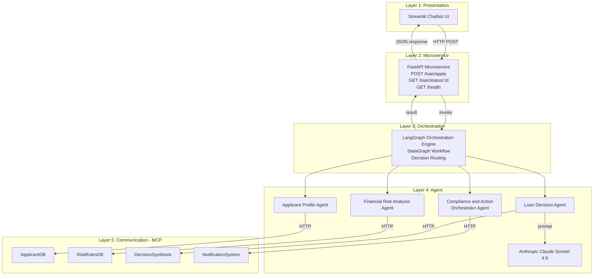

# System Architecture

## Five-Layer Architecture

```mermaid
graph TD
    subgraph "Layer 1: Presentation"
        UI[Streamlit Chatbot UI]
    end

    subgraph "Layer 2: Microservice"
        API[FastAPI Microservice\nPOST /loan/apply\nGET /loan/status/:id\nGET /health]
    end

    subgraph "Layer 3: Orchestration"
        LG[LangGraph Orchestration Engine\nStateGraph Workflow\nDecision Routing]
    end

    subgraph "Layer 4: Agent"
        A1[Applicant Profile Agent]
        A2[Financial Risk Analysis Agent]
        A3[Loan Decision Agent]
        A4[Compliance and Action\nOrchestrator Agent]
        LLM[Anthropic Claude Sonnet 4.6]
    end

    subgraph "Layer 5: Communication - MCP"
        MCP1[ApplicantDB]
        MCP2[RiskRulesDB]
        MCP3[DecisionSynthesis]
        MCP4[NotificationSystem]
    end

    UI -->|HTTP POST| API
    API -->|invoke| LG
    LG --> A1
    LG --> A2
    LG --> A3
    LG --> A4
    A3 -->|prompt| LLM
    A1 -->|HTTP| MCP1
    A2 -->|HTTP| MCP2
    A3 -->|HTTP| MCP3
    A4 -->|HTTP| MCP4
    LG -->|result| API
    API -->|JSON response| UI
```
