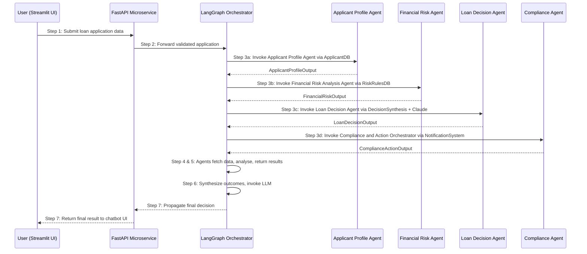

# Required Workflow

## Seven-Step Workflow

```mermaid
sequenceDiagram
    participant U as User (Streamlit UI)
    participant F as FastAPI Microservice
    participant O as LangGraph Orchestrator
    participant A1 as Applicant Profile Agent
    participant A2 as Financial Risk Agent
    participant A3 as Loan Decision Agent
    participant A4 as Compliance Agent

    U->>F: Step 1: Submit loan application data
    F->>O: Step 2: Forward validated application
    O->>A1: Step 3a: Invoke Applicant Profile Agent via ApplicantDB
    A1-->>O: ApplicantProfileOutput
    O->>A2: Step 3b: Invoke Financial Risk Analysis Agent via RiskRulesDB
    A2-->>O: FinancialRiskOutput
    O->>A3: Step 3c: Invoke Loan Decision Agent via DecisionSynthesis + Claude
    A3-->>O: LoanDecisionOutput
    O->>A4: Step 3d: Invoke Compliance and Action Orchestrator via NotificationSystem
    A4-->>O: ComplianceActionOutput
    O->>O: Step 4 & 5: Agents fetch data, analyse, return results
    O->>O: Step 6: Synthesize outcomes, invoke LLM
    O-->>F: Step 7: Propagate final decision
    F-->>U: Step 7: Return final result to chatbot UI
```
